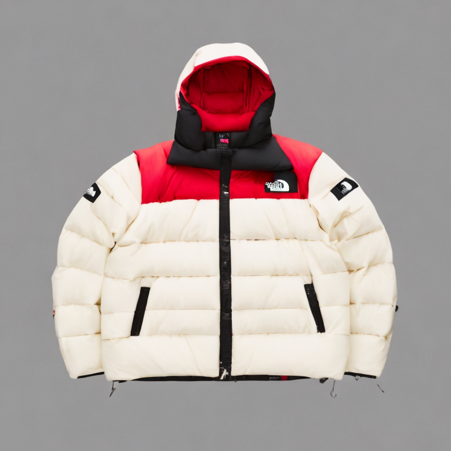

# Revolutionizing Fashion with AI Outfit Recommendation, Outfit Generation, Virtual Try-On, and Fashion Chatbot

Experience the future of fashion with **stylist AI**, where innovation meets style. Our cutting-edge platform revolutionizes your wardrobe by offering personalized outfit recommendations and generating unique ensembles tailored just for you. Explore our virtual try-on feature to visualize your perfect look effortlessly. Engage in fashion-forward conversations and get expert styling advice with our AI-powered chatbot. Elevate your fashion game with stylist AI and discover a new era of effortless elegance.

# stylist Ai : Five Models

 1. [Text-To-Outfit-Generator](#Text-To-Outfit-Generator)
 2. [Human-Detection](#Human-Detection)
 3. [Outfit-Recommendation](#Outfit-Recommendation)
 4. [Virtual-Try-On](#Virtual-Try-On)
 5. [Chat-Bot](#Chat-Bot)

## Text-To-Outfit-Generator

This code snippet demonstrates the utilization of a Text-Outfit-Generator model, leveraging a pretrained model from Hugging Face. The model is part of the DiffusionPipeline package, facilitating the generation of outfit descriptions based on textual prompts. By loading the model onto the available device, the script efficiently processes the input prompt and produces an image of the described outfit. Notably, running this code in **Google Colab** exceeded 15 minutes, but leveraging **Intel's CPU** or **XPU** ensures completion in less than a minute.

**Hugging Face URL** : [Fashion-Product-Generator](https://huggingface.co/NouRed/sd-fashion-products)

>Prompt : outer, The North Face x Supreme White Label Nuptse Down Jacket Cream, a photography of a white puffer jacket with a red box logo on the front.

**Folder Link** : [Click Here](https://github.com/dhaan-ish/intelOneApiHackathon/tree/main/Text-To-Outfit-Generator)

## Human-Detection

**Folder Link** : [Click Here](https://github.com/dhaan-ish/intelOneApiHackathon/tree/main/Human-Detection)

## Outfit-Recommendation

This code snippet demonstrates the implementation of an outfit-recommendation model using **Semantic Image Search** techniques. Leveraging the Langchain library, it combines BM25 retrieval with dense vector retrieval using CLIP embeddings. The outfit recommendation process involves encoding sparse and dense vectors from fashion metadata and images, persisting them in a vector database, and utilizing retrievers to search and display relevant outfit suggestions. By integrating both textual and visual cues, this model enhances the accuracy and diversity of outfit recommendations based on the **color** and **ocassion** given by user. catering to a wide range of fashion preferences.

> Selected Ocassion : Wedding
> Selected Color : White

**Folder Link** : [Click Here](https://github.com/dhaan-ish/intelOneApiHackathon/tree/main/Outfit-Recommendation)

## Virtual-Try-On

This code implements a **Virtual-Try-On (VTON)** model that allows users to try on clothes virtually using an input image. The model consists of several steps, including clothing segmentation, pose estimation, and image composition.

1.  **Clothing Segmentation:** The `get_cloth_mask.py` script utilizes a pre-trained model to segment clothing from the input image, generating a mask that isolates the clothing item.
    
2.  **Pose Estimation:** The `posenet.py` script estimates the pose of the person in the input image using a PoseNet model. It detects key body keypoints, necessary for aligning the clothing item with the person's body.
    
3.  **Image Processing:** The main process in `main.py` combines the segmented clothing mask and the pose estimation results to compose a final image of the person wearing the virtual clothes. It involves resizing the input image, generating semantic segmentation, removing the background, and adding the clothing item onto the person in the image.
    
4.  **Final Output:** The model produces a final image (`finalimg.png`) that showcases the person wearing the virtual clothes. The user can choose to retain the original background or remove it from the final composition.

**Folder Link** : [Click Here](https://github.com/dhaan-ish/intelOneApiHackathon/tree/main/Virtual-Try-On)

## Chat-Bot

This code configures a chatbot using the **Mistral 7B** model, fine-tuned with a custom dataset. It employs various libraries and tools for setting up the chatbot environment, transformers, LLAMA Index, and Langchain embeddings. The process involves installing necessary dependencies, downloading the custom dataset (in PDF format), loading the dataset into LLAMA Index, configuring the Mistral 7B model for language generation, and setting up the Langchain embeddings for semantic understanding. Finally, it initializes the chatbot's query engine and demonstrates a sample query for testing purposes.
>
>Prompt : 
>
>
>Output : 
>
>
>Prompt : 
>
>
>Output : 
>
>
**Folder Link** : [Click Here](https://github.com/dhaan-ish/intelOneApiHackathon/tree/main/Chat-Bot)

# Usage of Intel Developer Cloud

Utilizing the resources provided by Intel Developer Cloud significantly expedited our AI model development and deployment processes. Specifically, we harnessed the power of Intel's CPU and XPU to accelerate two critical components of our project: Human Detection and Text-to-Outfit Generation.

1.  **Human Detection Model Training:** The Intel Developer Cloud's CPU and XPU capabilities played a pivotal role in reducing the training time of our Human Detection model. By leveraging the high-performance computing infrastructure provided by Intel, we were able to train our model more efficiently, significantly cutting down the time required for model optimization and experimentation. Additionally, the optimized version of TensorFlow for Intel architectures further contributed to reducing the training time, ensuring optimal utilization of Intel's hardware resources. This integration of optimized TensorFlow with Intel's advanced computing infrastructure enabled us to achieve significant improvements in model training efficiency, ultimately accelerating our development process.
    
2.  **Text-to-Outfit Generation:** The Text-to-Outfit Generator component of our project involved complex computational tasks, particularly during outfit generation and rendering. Running these computations in Google Colab often resulted in long processing times due to resource limitations. However, by leveraging Intel Developer Cloud's CPU and XPU resources, we experienced a notable reduction in processing time. The parallel processing capabilities of Intel's infrastructure enabled us to generate outfit recommendations swiftly, enhancing the overall user experience.
    
In summary, Intel Developer Cloud's advanced CPU and XPU technologies provided us with the computational power necessary to expedite model training and inference processes, ultimately accelerating our project development and deployment timelines.

# Built With
1.  **Frontend - React:** Our frontend user interface was developed using React, a popular JavaScript library for building user interfaces. React's component-based architecture allowed us to create modular and reusable UI components, facilitating the development of a responsive and interactive user experience.
    
2.  **Backend - Flask:** The backend of our application was built using Flask, a lightweight and flexible web framework for Python. Flask provided us with the necessary tools to develop RESTful APIs and handle server-side logic efficiently. Its simplicity and extensibility allowed us to quickly implement features such as user authentication, data processing, and interaction with machine learning models.
    
3.  **Machine Learning Models:** Our application integrates various machine learning models to provide intelligent features and recommendations. These models were developed using state-of-the-art libraries and frameworks, including TensorFlow, PyTorch, and Hugging Face Transformers. Leveraging the power of machine learning, we implemented functionalities such as outfit recommendation, virtual try-on, fashion chatbot, and human detection.
    
4.  **Other Technologies:** In addition to React, Flask, and machine learning models, our application utilizes a range of other technologies to enhance performance, security, and user experience. These include:
    
    -   **Gradio:** A user-friendly library for creating connection between front end and ml models, enabling seamless integration of AI features into our application.
    -   **LLAMA Index:** A powerful indexing and search engine for efficient retrieval of fashion-related data, contributing to faster outfit recommendations and search functionalities.
    -   **Intel Developer Cloud:** Leveraging Intel's high-performance CPU and XPU capabilities, we accelerated model training and inference processes, reducing processing time and improving overall performance.

# What It Does
Our application offers an immersive and interactive experience for users seeking fashion advice and outfit recommendations. Here's a breakdown of its key functionalities:

1.  **Outfit Recommendation Based on Occasion:**
    
    -   Users start by selecting an occasion for which they need outfit recommendations. The frontend interface provides a list of predefined occasions, such as casual, formal, party, etc.
    -   Upon selecting an occasion, the application prompts users to choose their preferred color palette or style preferences to tailor the recommendations further.
2.  **Virtual Try-On Experience:**
    
    -   After selecting an occasion and specifying style preferences, users are presented with a curated list of clothing items that match their criteria.
    -   Users can browse through the suggested clothing items and select one that interests them. They can then virtually try on the selected clothing item by uploading their image.
    -   Our machine learning models perform virtual try-on, overlaying the selected clothing item onto the user's uploaded image. Users can visualize how the outfit looks on them in real-time.
3.  **Outfit Recommendation Based on Prompt:**
    
    -   Alternatively, users can opt for outfit recommendations based on specific prompts or descriptions. The frontend interface allows users to input their prompt, such as "black formal dress" or "summer beach outfit."
    -   Upon entering the prompt, the application processes the input and generates relevant outfit suggestions based on machine learning algorithms trained on fashion datasets.
4.  **Integrated Fashion Chatbot:**
    
    -   To further assist users and address their fashion-related queries, our application features an integrated fashion chatbot.
    -   Users can activate the chatbot through the frontend interface, leveraging natural language processing (NLP) capabilities to engage in conversation, ask questions, and seek fashion advice.
    -   The chatbot leverages advanced language models to understand user queries and provide relevant responses, helping users make informed fashion choices and clear any doubts they may have.

In summary, our application combines advanced machine learning techniques with a user-friendly frontend interface to offer personalized outfit recommendations, virtual try-on experiences, and interactive fashion assistance through a seamlessly integrated fashion chatbot.

# How We Built It 

 -  Developed frontend using React for a modular and reusable UI.
 -  Implemented backend with Flask for RESTful APIs and data processing.
 -  Integrated various machine learning models for outfit recommendation, virtual try-on, and fashion chatbot functionalities. 
 -  Implemented virtual try-on feature with complex image processing and machine learning techniques. 
 -  Integrated a fashion chatbot leveraging natural language processing (NLP) capabilities. 

# References For Datasets

 - Virtual-Try-On : [VITON](https://www.kaggle.com/datasets/marquis03/hr-viton)
 - Chat-Bot : [PDF](https://github.com/dhaan-ish/intelOneApiHackathon/blob/main/Chat-Bot/Data/fashsion.pdf)
 - Outfit-Recommendation : [Kaggle](https://www.kaggle.com/datasets/paramaggarwal/fashion-product-images-dataset)]
 - Human-Detection : [Roboflow](https://universe.roboflow.com/human-classification/human-qgzuc)

# Transforming E-commerce
To monetize this solution for large online outfit e-commerce websites, we offer a comprehensive fashion platform that enhances user engagement, improves conversion rates, and drives sales. By integrating our advanced outfit recommendation, virtual try-on, and fashion chatbot functionalities, e-commerce websites can provide a personalized and interactive shopping experience to their customers, leading to increased user satisfaction, higher retention rates, and ultimately, greater revenue generation through increased sales and customer loyalty. Our solution offers a competitive edge in the market by leveraging cutting-edge technology to deliver unparalleled convenience and customization, ultimately translating into higher profitability for online outfit e-commerce businesses.
